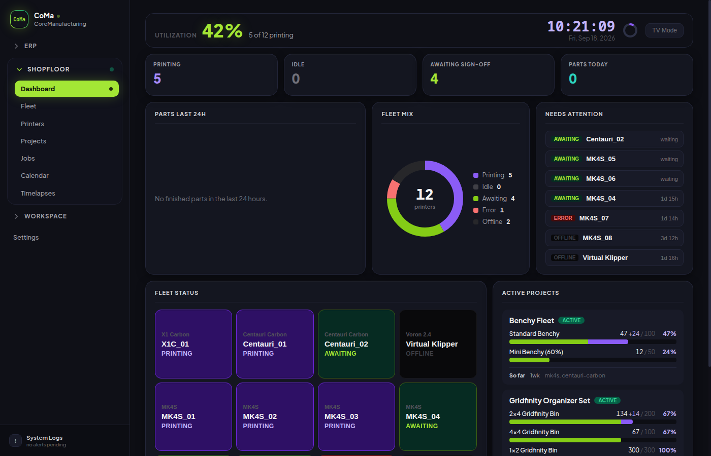
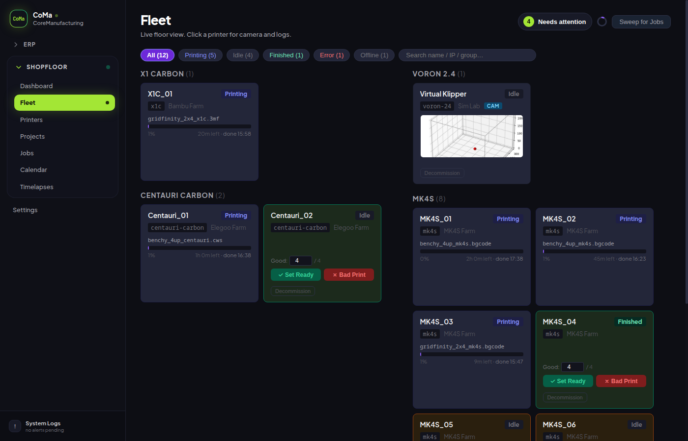

# CoMa / CoreManufacturing

A self-hosted web app for managing a multi-brand 3D printer fleet **and** an embedded manufacturing ERP (inventory, costing, work orders, sales) in one process and one SQLite database.

This repository is a Linux-focused fork of [joeltelling/print-farm-manager](https://github.com/joeltelling/print-farm-manager). The original project and its contributors remain the upstream source.

The operator-facing product name is **CoMa** (short) / **CoreManufacturing** (long). Internal keys such as `farm_name` and Docker service names stay unchanged so existing installs keep working.

No cloud. No subscriptions. No vendor lock-in.



> **Security note:** This app has no built-in authentication. It is designed to run on a trusted local network only. Do not expose port 3000 (or 5173 in dev) to the internet: your printer API keys are served to any client that can reach the server. Run it behind your router's firewall or a local VPN.

---

## What It Does

### Shopfloor (printer farm)

- **Live fleet view** - every printer's status, progress, and time remaining, refreshing every 15 seconds
- **Automated job dispatch** - projects, parts, G-code upload; the scheduler assigns idle printers
- **Operator confirmation flow** - finished prints stay held until a human signs off (Set Ready / Bad Print)
- **Multi-brand support** - Prusa, Elegoo, Bambu, Klipper, and OctoPrint in one fleet
- **CSV fleet import** - add dozens of printers from a spreadsheet
- **TV dashboard** - utilization, parts-per-hour, Needs Attention queue
- **Incident view** - per-printer camera feed, event log, manual notes
- **Timelapses** - JPEG capture while printing (or manual per machine), optional MP4 via host `ffmpeg`
- **Machine telemetry** - real print seconds, energy estimate, status history for utilization / OEE

### Embedded ERP (same app, same DB)

- **Masters linked to shopfloor** - project↔product, part↔component, printer↔machine, filament↔raw
- **Inventory + WAC** - receive raw, issue on postings / WO / sales
- **Machine rates** - manual USD/h or calculated (maintenance + kW × electricity)
- **Manufacturing components, BOM, work orders** - including local QR pick-list completion
- **Sales** - pricing, orders, CSV/PDF history
- **Shopfloor posting queue** - Set Ready enqueues stock moves; confirm in ERP (never touches `completed_qty`)
- **Actual costing** - when job telemetry is `measured`, inventory is valued from real machine time / material / energy; otherwise standard recipe cost
- **Analytics** - profitability by project, machine OEE, std vs actual cost variance

### Ops

- **Site backup and restore** - one JSON for shopfloor + ERP + settings + G-code files
- **Organic vs seed databases** - keep real farm data separate from demo fixtures



**New here?** Read the operator walkthrough: **[docs/user-guide.md](docs/user-guide.md)** (Spanish). Technical index: **[docs/README.md](docs/README.md)**.

---

## Supported Printers

| Brand | Protocol | Models |
|---|---|---|
| **Prusa** | PrusaLink REST API | MK4S, XL, and other PrusaLink-compatible models |
| **Elegoo** | SDCP WebSocket (Centauri Carbon) · MQTT (Centauri Carbon 2) | Centauri Carbon, Centauri Carbon 2 |
| **Bambu Lab** | MQTT + FTPS | X1C, P1S, and other Bambu models (with AMS slot selection) |
| **Klipper** | Moonraker REST API | Voron and any Klipper-firmware printer (webcam via Moonraker) |
| **OctoPrint** | OctoPrint REST API | Any printer running OctoPrint / OctoPi |

Camera auto-discovery is implemented for Klipper. Any printer can also use optional snapshot/stream URL overrides. Timelapse has been exercised on the Virtual Klipper simulator path; not yet validated on physical hardware.

---

## Tech Stack

### Backend
| Package | Role |
|---|---|
| [Node.js](https://nodejs.org) + [Express](https://expressjs.com) | HTTP API: shopfloor + `/api/erp/*` + SPA |
| [better-sqlite3](https://github.com/WiseLibs/better-sqlite3) | Embedded SQLite - synchronous, zero configuration |
| [axios](https://axios-http.com) | HTTP to Prusa, Klipper, OctoPrint, camera snapshots |
| [mqtt](https://github.com/mqttjs/MQTT.js) | MQTT over TLS for Bambu |
| [basic-ftp](https://github.com/patrickjuchli/basic-ftp) | FTPS upload to Bambu |
| [sdcp](https://github.com/blakejrobinson/sdcp) | Elegoo SDCP WebSocket |
| [multer](https://github.com/expressjs/multer) | G-code upload |
| [papaparse](https://www.papaparse.com) | CSV fleet import |
| [form-data](https://github.com/form-data/form-data) | Multipart upload for Moonraker |
| Host `ffmpeg` (optional) | Timelapse MP4 render (`child_process.spawn`, not an npm dependency) |
| [PM2](https://pm2.keymetrics.io) | Optional process manager for bare-metal production |

### Frontend
| Package | Role |
|---|---|
| [React 18](https://react.dev) | UI |
| [React Router v6](https://reactrouter.com) | Client routing (shopfloor + `/erp/*`) |
| [Vite](https://vitejs.dev) | Build and dev server |

### Data
| Technology | Role |
|---|---|
| SQLite (via better-sqlite3) | One file for shopfloor + ERP (`server/data/*.db`) |

There is **no** Python / uvicorn / Acres HTML process at runtime. Sources under `erp/` are reference only.

---

## Quick Start (Linux Development)

Requires Linux, Git, Node.js 22 or 23, npm, `setsid`, and the native-module build toolchain (Python 3, `make`, and a C++ compiler during dependency installation only). The [Linux installation guide](docs/installation.md) includes commands for Debian, Ubuntu, Fedora, and RHEL-compatible systems.

```bash
git clone https://github.com/mdwcoder/core-manufacturing.git
cd core-manufacturing
./start.sh
```

- API + embedded ERP: `http://localhost:3000`
- Web UI (hot reload): `http://localhost:5173`

`start.sh` validates Node.js, installs locked dependencies when needed, builds the initial client bundle, and starts Express + Vite in the background. Use `./stop.sh` and `./restart.sh` to manage them. Logs: `.run/dev.log`.

**Databases:**

| Flag | File | Use |
|---|---|---|
| `--organic-data` (default) | `server/data/organic-data.db` | Real operator data |
| `--seed-data` | `server/data/seed-data.db` | Demo fixtures |

```bash
npm run seed:data
./start.sh --seed-data --with-simulator
```

That opens the seed DB with a live Virtual Klipper at `127.0.0.1` while other seeded printers keep frozen statuses (unless you poll them outside demo mode). See [installation.md](docs/installation.md#virtual-klipper-printer) for the one-time simulator clone.

### Prefer Docker instead of a local Node.js install?

```bash
git clone https://github.com/mdwcoder/core-manufacturing.git
cd core-manufacturing
docker compose up --build print-farm-manager-dev
```

- API: `http://localhost:3000`
- UI: `http://localhost:5173`

Run tests with `docker compose exec print-farm-manager-dev npm test`.

---

## Installation (Production)

### Option A - Docker (recommended)

Requires [Docker](https://docs.docker.com/get-docker/) (and Compose).

#### Quickest start - pull the published image

A multi-arch image (`linux/amd64` + `linux/arm64`) is published automatically to GitHub Container Registry on every release - see [docs/docker-publish.md](docs/docker-publish.md). Save this as `docker-compose.yml`:

This image is published by the upstream project. To run this fork's changes (ERP, telemetry, timelapse), use the source-build option below until the fork publishes its own image.

```yaml
services:
 print-farm-manager:
 image: ghcr.io/joeltelling/print-farm-manager:latest
 container_name: print-farm-manager
 restart: unless-stopped
 ports:
 - "3000:3000"
 volumes:
 - farm-data:/app/server/data
 - farm-gcode:/app/server/gcode

volumes:
 farm-data:
 farm-gcode:
```

```bash
docker compose up -d
```

Open `http://localhost:3000` (or the machine's LAN IP).

**Updating:**

```bash
docker compose pull
docker compose up -d
```

| Command | What it does |
|---|---|
| `docker compose logs -f` | Follow server logs |
| `docker compose stop` | Stop (data preserved) |
| `docker compose up -d` | Start again |
| `docker compose down` | Remove container (volumes preserved) |

Pin a release with a version tag, e.g. `ghcr.io/joeltelling/print-farm-manager:1.2.0`. `edge` tracks `main` between releases.

#### Building this fork from source

```bash
git clone https://github.com/mdwcoder/core-manufacturing.git
cd core-manufacturing
docker compose up -d --build
```

```bash
git pull
docker compose up -d --build
```

Optional host packages for timelapse MP4: install `ffmpeg` on the host or inside a custom image. Without it, CoMa still stores JPEG frames.

> Same security note: only publish port 3000 on a trusted LAN.

### Option B - Bare metal (Node.js on the host)

Full walkthrough: **[Installation Guide](docs/installation.md)**.

```bash
npm ci
npm ci --prefix client
npm run build
npm start
```

Open `http://localhost:3000`. For timelapse video render: `sudo dnf install ffmpeg` (Fedora) or `sudo apt install ffmpeg` (Debian/Ubuntu).

---

## Operator map (after install)

| Goal | Where |
|---|---|
| See the fleet / confirm prints | Shopfloor → Fleet |
| Projects, parts, G-code | Shopfloor → Projects |
| Sync printers into ERP | ERP → Dashboard → Sync |
| Receive filament / raw | ERP → Inventory |
| Set machine USD/h or kW | ERP → Machines |
| Confirm stock after Set Ready | ERP → Postings |
| OEE / margin / cost variance | ERP → Analytics |
| Timelapse gallery | Shopfloor → Timelapses |
| Backup everything | Settings → Backup |

Step-by-step: **[docs/user-guide.md](docs/user-guide.md)**.

---

## CSV Import Format

Settings → Hardware → CSV import.

| Column | Required | Example |
|---|---|---|
| `name` | Yes | `MK4S_01` |
| `ip` | Yes | `192.168.1.100` |
| `type` | Yes | `prusa` / `elegoo-centauri` / `elegoo-centauri2` / `bambu` / `klipper` / `octoprint` |
| `api_key` | Prusa and OctoPrint (API key), Bambu and Centauri Carbon 2 (LAN access code) | `aK3jR7xQ2pLm9vN` |
| `serial_number` | Bambu and Centauri Carbon 2 | `01S00C123456789` |
| `group` | No | `MK4S Farm` |
| `model` | No | `mk4s` |

If `model` is omitted, CoMa infers it from the name when possible; otherwise select it after import.

---

## Project Structure

```
core-manufacturing/
├── server/
│ ├── index.js # Express: shopfloor + /api/erp + SPA
│ ├── db.js # SQLite schema + additive migrations
│ ├── poller.js # 15 s poll + telemetry + timelapse hooks
│ ├── scheduler.js # Dispatch + job close / seal telemetry
│ ├── telemetry.js # Status history + job accumulators
│ ├── timelapse.js # Frame capture + ffmpeg render
│ ├── camera.js # Shared snapshot fetch
│ ├── erp/ # Embedded ERP (schema, costing, postings, reports)
│ ├── drivers/ # prusa, elegoo-*, bambu, klipper, octoprint
│ └── routes/ # printers, projects, jobs, timelapses, backup, ...
├── client/ # React + Vite (Fleet, Projects, Erp, Timelapses, ...)
├── docs/ # Operator guide, API, ERP, installation, changelog
├── erp/ # Reference-only Acres/Python sources (not runtime)
├── start.sh / stop.sh # Linux dev process helpers
├── Dockerfile
└── docker-compose.yml
```

---

## Documentation

| Doc | Contents |
|---|---|
| [docs/user-guide.md](docs/user-guide.md) | **How to use CoMa** (operator walkthrough, Spanish) |
| [docs/README.md](docs/README.md) | Technical documentation index |
| [docs/installation.md](docs/installation.md) | Linux install, scripts, systemd, simulator |
| [docs/erp/README.md](docs/erp/README.md) | Embedded ERP, sync, postings, actual costing |
| [docs/api.md](docs/api.md) | REST contracts |
| [docs/web-app.md](docs/web-app.md) | React pages and UI conventions |
| [docs/database.md](docs/database.md) | Schema |
| [docs/CHANGELOG.md](docs/CHANGELOG.md) | Dated change log |

---

## License

MIT
