# CoMa / CoreManufacturing

**Self-hosted shopfloor + manufacturing ERP for a multi-brand 3D print farm.**

One Node process. One SQLite file. Live fleet dispatch for Prusa, Bambu, Elegoo, Klipper, and OctoPrint, plus inventory, costing, work orders, sales, eBay Sell sync, timelapses, and a planning calendar with production closures that actually stop new job dispatch.

Fork of [joeltelling/print-farm-manager](https://github.com/joeltelling/print-farm-manager), tuned for Linux ops. Product name: **CoMa** (short) / **CoreManufacturing** (long).

No cloud. No subscriptions. No vendor lock-in.

> **Security:** First run creates a single operator account (login + one-time setup guide). That gate is deliberately basic: one shared login, no CSRF token, no rate limiting, no TLS. Run only on a trusted LAN or VPN. Do not expose ports 3000 / 5173 to the internet. Anyone signed in can reach printer API keys and farm controls.

---

## Screenshots

Captured from the seed demo (`./start.sh --seed-data`) at 1400x900. Dark UI: ERP and Shopfloor share one sidebar.

### Sign in

Basic local login before the fleet UI mounts.

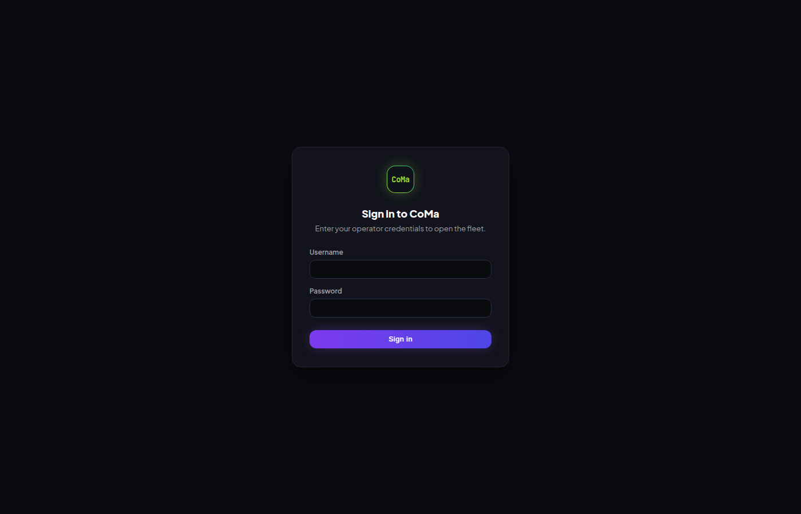

### Shopfloor dashboard

Utilization, fleet mix, Needs Attention queue, live printer cards, and active project progress.


### Live fleet

Multi-brand cards (Bambu, Voron/Klipper, Centauri, MK4S) with Set Ready / Bad Print when a print finishes held.


### Printers directory

Searchable list of every printer (active and decommissioned) with status, model, and group.

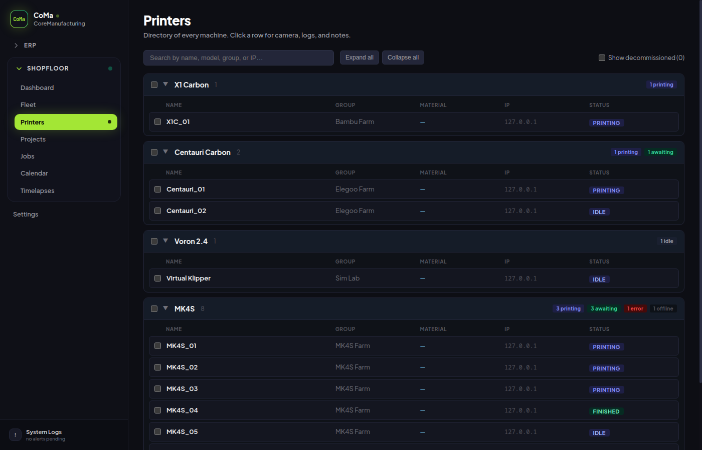

### Projects

Active production work: parts, target quantities, and G-code targeting per printer model.

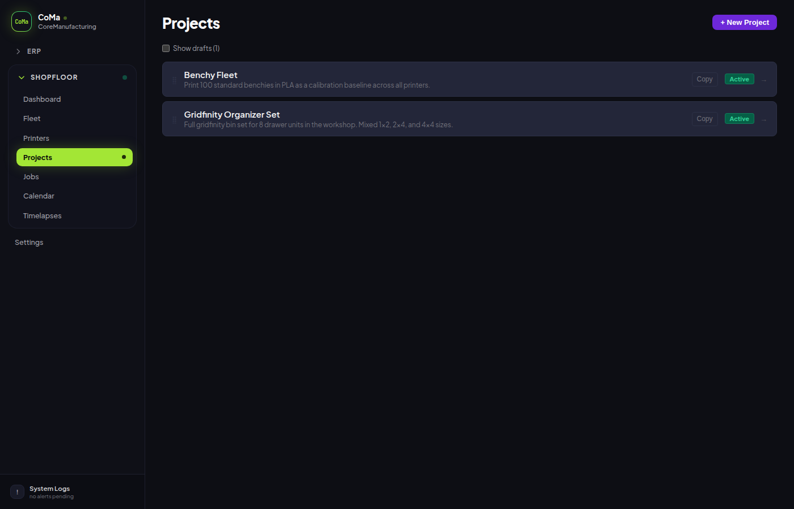

### Job queue

Uploads, active prints, awaiting sign-off, finished, and failed jobs with filters.

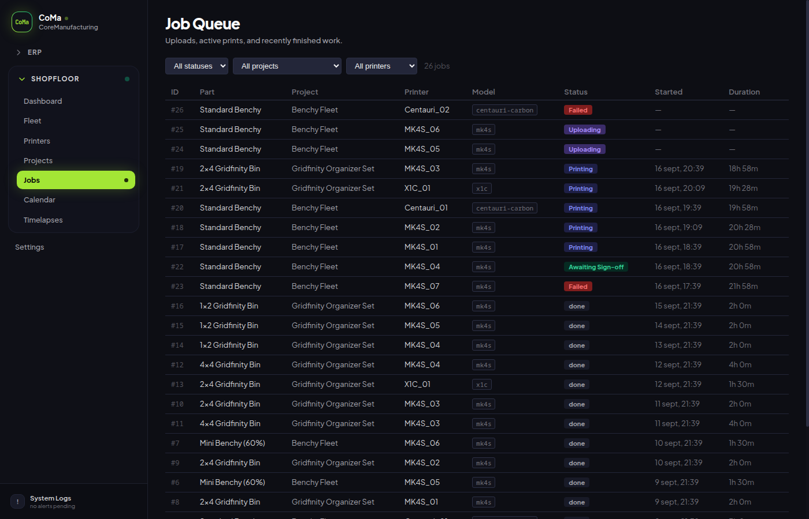

### Calendar

Planned stock arrivals, shipments, deadlines, notes, and **production closures** that block new job reservations. History chips overlay real jobs, sales, stock receipts, and work orders.

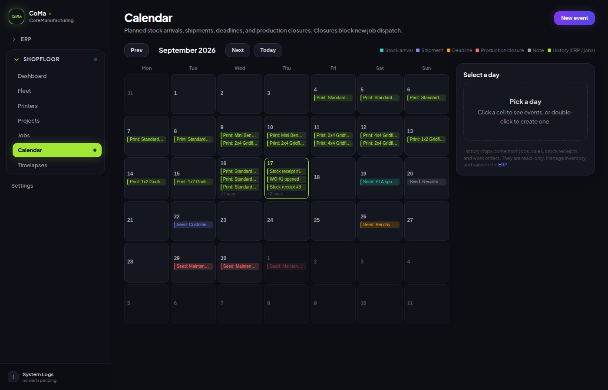

### Timelapses

Per-job JPEG frame captures; optional MP4 render when host `ffmpeg` is available.

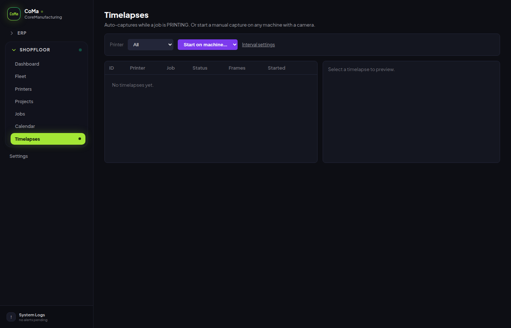

### Embedded ERP dashboard

Shopfloor sync, pending postings, stock value, and the "needs ERP data" action queue.

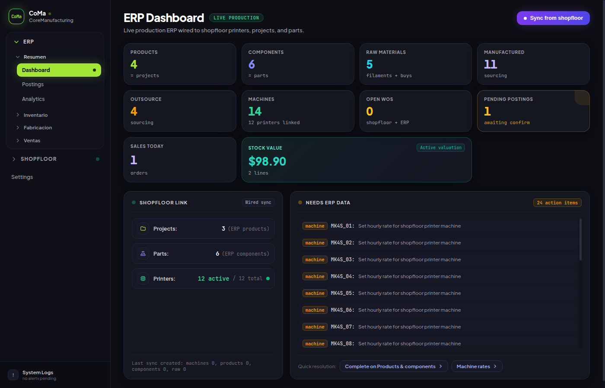

### Inventory

On-hand by warehouse (donut + bars) and receive-by-SKU.

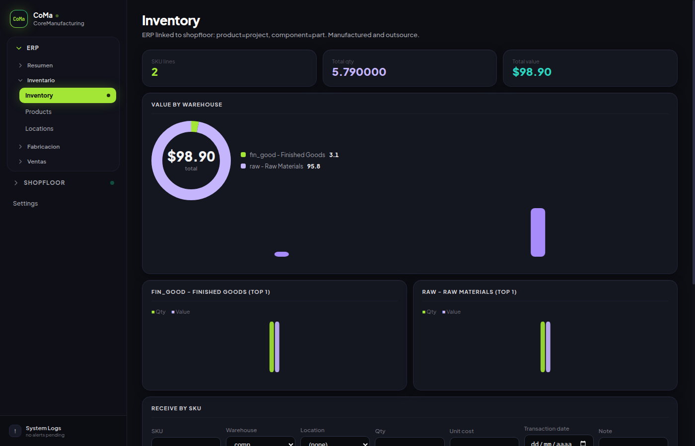

### Sales

Revenue / margin snapshot and finished-goods pricing matrix.

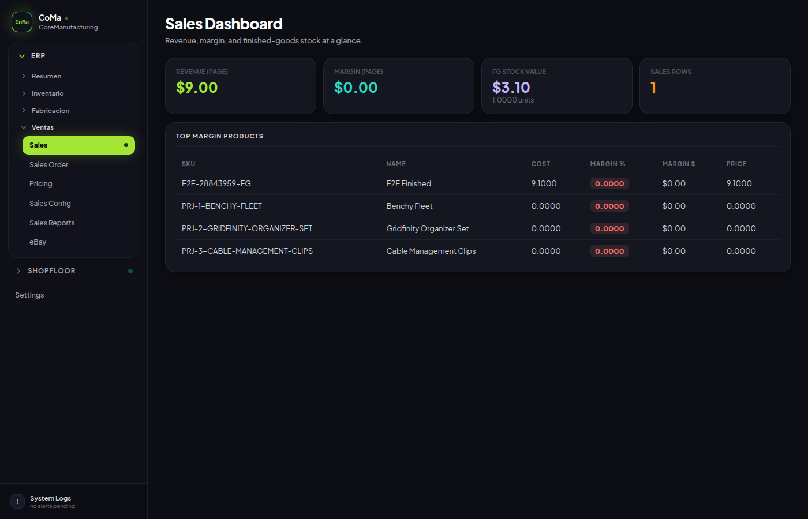

### Postings

Operator queue after Set Ready: confirm ERP stock moves without inventing part counts.

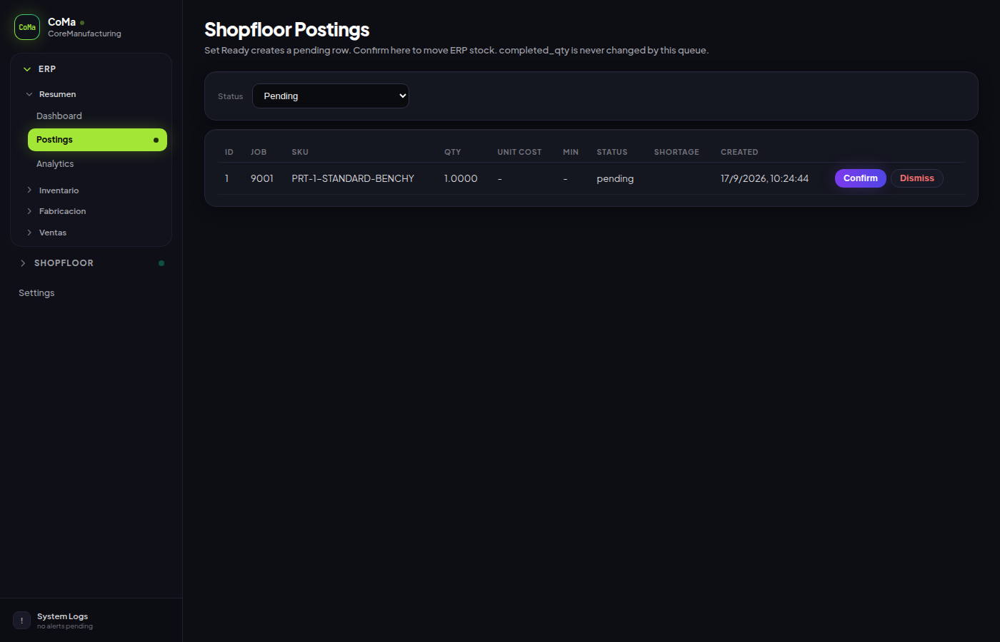

### eBay Sell

Sandbox credentials, SKU to offer mapping, pending order lines, inventory push.
(Not yet validated on a real eBay production account.)

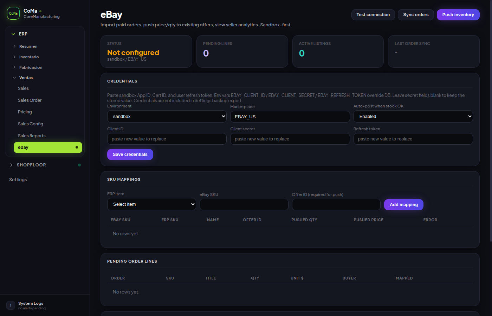

### Settings

Farm name, camera mode, timelapse, dispatch concurrency, hardware, backup, and account.

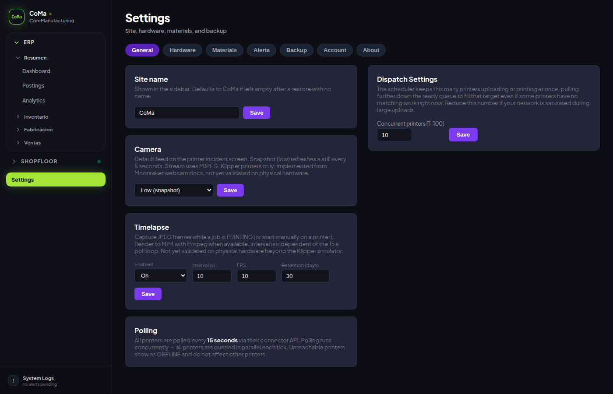

---

## Why CoMa

Print farms usually end up with a mash of vendor apps, spreadsheets, and a separate ERP. CoMa keeps the loop in one place:

1. **Dispatch** the next open part to an idle matching printer.
2. **Hold** the printer when the print finishes so a human confirms quality.
3. **Credit** inventory only from that confirmation (or an explicit operator action), never from a time-window guess after restart.
4. **Post** into the embedded ERP (stock, costing, sales) on the same database.
5. **Plan** arrivals, shipments, deadlines, and shutdown windows on the Calendar so the scheduler stops new work when the plant is closed.

That last point matters: a production closure is not a sticky note. While it is active, `_reserveJob` refuses new reservations. Prints already running keep going.

---

## What it does

### Shopfloor

| Capability | Detail |
|---|---|
| Live fleet | Status, progress, time remaining every 15 s |
| Automated dispatch | Projects → parts → G-code; idle / resolved printers get the next job |
| Operator hold | Set Ready / Bad Print before the next dispatch |
| Multi-brand | PrusaLink, Elegoo SDCP/MQTT, Bambu MQTT+FTPS, Moonraker, OctoPrint |
| CSV fleet import | Bulk add printers from Settings |
| TV dashboard | Fullscreen shopfloor view |
| Incident view | Per-printer camera + event log + stats |
| Timelapses | JPEG frames; MP4 via host `ffmpeg` when present |
| Telemetry | Utilization / OEE inputs for ERP analytics |
| Calendar | Planned events + hard production-closure gate |

### Embedded ERP (same app, same DB)

| Capability | Detail |
|---|---|
| Linked masters | project↔product, part↔component, printer↔machine, filament↔raw |
| Inventory | Warehouses, locations, receive-by-SKU, WAC |
| Manufacturing | Machine rates, BOM, work orders, QR pick lists |
| Sales | Pricing (including `EBAY_FEE`), orders, CSV/PDF history |
| Postings | Queue after Set Ready; never invents `completed_qty` |
| Analytics | Profitability, machine OEE, std vs actual variance |
| eBay Sell | Import paid orders, push price+qty to existing offers, seller analytics |

Guide: [docs/erp/ebay.md](docs/erp/ebay.md).

### Ops

- JSON backup for shopfloor + ERP + G-code files (`auth_*` and eBay secrets excluded on purpose)
- Organic vs seed databases so demos never overwrite real farm data
- Linux `./start.sh` / `./stop.sh` / `./restart.sh`, Docker Compose, optional PM2

**New here?** Operator walkthrough (Spanish): **[docs/user-guide.md](docs/user-guide.md)**. Tech index: **[docs/README.md](docs/README.md)**.

---

## Supported printers

| Brand | Protocol | Notes |
|---|---|---|
| **Prusa** | PrusaLink REST | MK4S, XL, and other PrusaLink models |
| **Elegoo** | SDCP (Centauri) · MQTT (CC2) | Centauri Carbon, Centauri Carbon 2 |
| **Bambu Lab** | MQTT + FTPS | X1C, P1S, AMS slot selection |
| **Klipper** | Moonraker REST | Voron and any Klipper printer; webcam via Moonraker |
| **OctoPrint** | OctoPrint REST | Any printer behind OctoPrint / OctoPi |

Camera auto-discovery: Klipper. Optional snapshot/stream URL overrides on any printer.

---

## Quick start (Linux)

Needs Linux, Git, Node.js 22 or 23, npm, `setsid`, and the native build toolchain for `better-sqlite3` (Python 3, `make`, C++ compiler at install time only). Distro notes: [docs/installation.md](docs/installation.md).

```bash
git clone https://github.com/mdwcoder/core-manufacturing.git
cd core-manufacturing
./start.sh
```

Open the UI and create the first operator account when prompted.

| URL | Role |
|---|---|
| `http://localhost:3000` | API + ERP + production SPA |
| `http://localhost:5173` | Vite UI (dev hot reload) |

Helpers: `./stop.sh`, `./restart.sh`. Logs: `.run/dev.log`.

### Demo with seed data

Screenshots in this README were taken this way:

```bash
npm run seed:data
./start.sh --seed-data --with-simulator
```

| Flag | Database file | Use |
|---|---|---|
| `--organic-data` (default) | `server/data/organic-data.db` | Real operator data |
| `--seed-data` | `server/data/seed-data.db` | Demo fixtures |

Refresh the screenshot gallery later with:

```bash
node scripts/capture-readme-screenshots.js
```

(Requires the seed UI running on ports 3000 / 5173 and a Chromium binary named `chromium-browser`.)

### Docker (dev)

```bash
docker compose up --build print-farm-manager-dev
```

Same ports as above. Tests: `docker compose exec print-farm-manager-dev npm test`.

---

## Production install

### Option A: Docker

Upstream publishes multi-arch images to GHCR ([docs/docker-publish.md](docs/docker-publish.md)). To run **this fork** (ERP, telemetry, timelapse, calendar, eBay), build from source until a fork image is published:

```bash
git clone https://github.com/mdwcoder/core-manufacturing.git
cd core-manufacturing
docker compose up -d --build
```

Open `http://localhost:3000` (or the machine LAN IP). Update with `git pull` then `docker compose up -d --build`.

For timelapse MP4, install `ffmpeg` on the host or in a custom image. Without it, JPEG frames still work.

### Option B: bare metal

Full guide: **[docs/installation.md](docs/installation.md)**.

```bash
npm ci
npm ci --prefix client
npm run build
npm start
```

---

## Operator map

| Goal | Where |
|---|---|
| See fleet / confirm prints | Shopfloor → Fleet |
| Projects, parts, G-code | Shopfloor → Projects |
| Job queue / cancel queued | Shopfloor → Jobs |
| Plan arrivals / closures | Shopfloor → Calendar |
| Timelapse gallery | Shopfloor → Timelapses |
| Sync printers into ERP | ERP → Dashboard → Sync from shopfloor |
| Receive filament / raw | ERP → Inventory |
| Machine USD/h or kW | ERP → Machines |
| Confirm stock after Set Ready | ERP → Postings |
| OEE / margin / cost variance | ERP → Analytics |
| eBay orders and inventory push | ERP → Ventas → eBay |
| Backup / account | Settings |

---

## CSV import

Settings → Hardware → CSV import.

| Column | Required | Example |
|---|---|---|
| `name` | Yes | `MK4S_01` |
| `ip` | Yes | `192.168.1.100` |
| `type` | Yes | `prusa` / `elegoo-centauri` / `elegoo-centauri2` / `bambu` / `klipper` / `octoprint` |
| `api_key` | Prusa, OctoPrint; Bambu/CC2 LAN code | `aK3jR7xQ2pLm9vN` |
| `serial_number` | Bambu and Centauri Carbon 2 | `01S00C123456789` |
| `group` | No | `MK4S Farm` |
| `model` | No | `mk4s` |

---

## Tech stack

| Layer | Stack |
|---|---|
| Server | Node 22/23, Express, better-sqlite3, axios, mqtt, basic-ftp, sdcp, multer, papaparse |
| Client | React 18, React Router 6, Vite (no CSS framework; design tokens in `client/src/theme.js`) |
| Data | One SQLite file for shopfloor + ERP (`server/data/*.db`) |

No Python runtime for CoMa or the ERP. Optional host `ffmpeg` for timelapse render. Optional PM2 for bare-metal process management.

Node is pinned to `>=22 <24` because native `better-sqlite3` builds break on Node 24 on Windows (the production farm machine Joel runs is Windows-capable; Linux is the primary path for this fork).

---

## Project structure

```
core-manufacturing/
├── server/
│   ├── index.js            # Express: shopfloor + /api/erp + /api/erp/ebay + SPA
│   ├── db.js               # SQLite + additive migrations
│   ├── poller.js           # 15 s poll + telemetry + timelapse hooks
│   ├── scheduler.js        # Dispatch + job close + calendar gate
│   ├── calendar-gate.js    # Shared production-closure check
│   ├── auth.js             # Local login (scrypt + session cookie)
│   ├── erp/                # Embedded ERP
│   ├── ebay/               # eBay Sell client, orders, inventory push, runner
│   ├── drivers/            # prusa, elegoo-*, bambu, klipper, octoprint
│   └── routes/             # printers, projects, calendar, backup, ...
├── client/                 # React + Vite SPA
├── docs/                   # Guides, API, images used in this README
├── scripts/
│   └── capture-readme-screenshots.js
├── start.sh / stop.sh / restart.sh
├── Dockerfile
└── docker-compose.yml
```

---

## Documentation

| Doc | Contents |
|---|---|
| [docs/user-guide.md](docs/user-guide.md) | Operator walkthrough (Spanish) |
| [docs/README.md](docs/README.md) | Technical index |
| [docs/installation.md](docs/installation.md) | Linux install, scripts, systemd, simulator |
| [docs/calendar.md](docs/calendar.md) | Planned events and production-closure gate |
| [docs/erp/README.md](docs/erp/README.md) | Embedded ERP |
| [docs/erp/ebay.md](docs/erp/ebay.md) | eBay Sell integration |
| [docs/api.md](docs/api.md) | REST contracts |
| [docs/web-app.md](docs/web-app.md) | React pages and UI |
| [docs/database.md](docs/database.md) | Schema |
| [docs/CHANGELOG.md](docs/CHANGELOG.md) | Dated change log |
| [CONTRIBUTING.md](CONTRIBUTING.md) | How to contribute |

---

## Tests

```bash
npm test
```

Server suites use Jest + supertest against in-memory SQLite. Client has no separate test harness; `npm run build --prefix client` is the compile check.

---

## License

MIT
